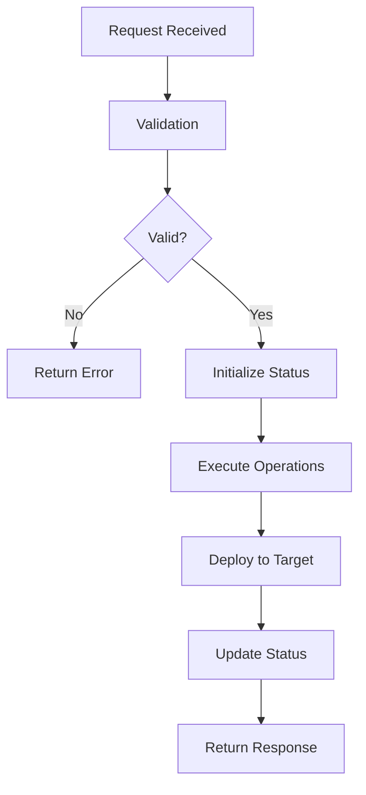

# HVSCMA Sync System

🚀 **Comprehensive synchronization system for HVSCMA CMA reports and data management**

## Overview

The HVSCMA Sync System provides robust, scalable synchronization capabilities between GitHub repositories, Netlify deployments, and local systems. Built for the Hudson Valley Short Course Masters Aquatics (HVSCMA) CMA management platform.

### 🎯 Key Features

- **Multi-Platform Sync**: GitHub ↔ Netlify ↔ Local systems
- **Schema-Based Validation**: JSON Schema validation for all requests
- **Progress Tracking**: Real-time status and progress monitoring
- **Error Handling**: Comprehensive error reporting and recovery
- **Template System**: Pre-defined sync templates for common operations
- **Monitoring**: Built-in health checks and metrics collection

## 📁 Directory Structure

```
sync/
├── README.md                          # This file
├── coordination/                      # Core coordination logic
│   ├── sync_coordinator.py           # Main orchestration engine
│   ├── request_handler.py            # Request processing and validation
│   └── status_manager.py             # Status tracking and reporting
├── templates/                         # Schema and configuration templates
│   ├── sync_request_schema.json      # Request validation schema
│   ├── sync_response_template.json   # Response format template
│   └── config_template.yaml          # Configuration template
├── integration/                       # External system integrations
│   ├── github_connector.py           # GitHub API integration
│   ├── netlify_connector.py          # Netlify deployment integration
│   └── validation_engine.py          # Validation logic
└── monitoring/                        # Monitoring and health checks
    ├── health_check.py               # System health monitoring
    ├── metrics_collector.py          # Performance metrics
    └── alert_system.py               # Alert notifications
```

## 🚀 Quick Start

### 1. Configuration

Copy the configuration template and customize for your environment:

```bash
cp sync/templates/config_template.yaml config.yaml
```

Edit `config.yaml` with your credentials and settings:

```yaml
github:
  token: "your_github_token"
  organization: "HVSCMA"
  default_repository: "hvscma-cmas"

netlify:
  site_id: "your_netlify_site_id"
  auth_token: "your_netlify_token"
```

### 2. Basic Usage

```python
from sync.coordination.sync_coordinator import SyncCoordinator
from sync.coordination.request_handler import SyncRequestHandler
import yaml

# Load configuration
with open('config.yaml', 'r') as f:
    config = yaml.safe_load(f)

# Initialize components
coordinator = SyncCoordinator(config)
handler = SyncRequestHandler(config)

# Create sync request
request = handler.create_request_from_template(
    "github_to_netlify",
    source_repo="HVSCMA/hvscma-cmas",
    files=["*.html", "assets/*"],
    requestor="admin"
)

# Execute sync
response = await coordinator.process_sync_request(request)
print(f"Sync completed: {response['status']['code']}")
```

## 📋 Request Schema

### Sync Request Format

```json
{
  "sync_id": "sync_abc123def456",
  "timestamp": "2025-01-01T12:00:00Z",
  "source": {
    "type": "github",
    "repository": "HVSCMA/hvscma-cmas", 
    "branch": "main",
    "path": "/"
  },
  "target": {
    "type": "netlify",
    "repository": "hvscma-production",
    "path": "/"
  },
  "operations": [
    {
      "action": "sync",
      "files": ["*.html", "assets/*"],
      "options": {}
    }
  ],
  "priority": "medium",
  "metadata": {
    "requestor": "system",
    "description": "Daily sync operation"
  }
}
```

### Available Operations

| Operation | Description | Files Parameter |
|-----------|-------------|----------------|
| `create` | Create new files | List of file paths to create |
| `update` | Update existing files | List of file paths to update |
| `delete` | Remove files | List of file paths to delete |
| `sync` | Synchronize files (create/update as needed) | List of file patterns or paths |

## 🔄 Sync Process Flow



### Status Lifecycle

1. **PENDING** - Request received, awaiting processing
2. **IN_PROGRESS** - Processing started
3. **VALIDATING** - Validating request and source data
4. **SYNCING** - Executing sync operations
5. **DEPLOYING** - Deploying to target system
6. **SUCCESS** - Operation completed successfully
7. **FAILED** - Operation failed with recoverable error
8. **ERROR** - Operation failed with unrecoverable error

## 🛠️ API Reference

### SyncCoordinator

Main orchestration class for sync operations.

```python
coordinator = SyncCoordinator(config)

# Process sync request
response = await coordinator.process_sync_request(request)
```

### SyncRequestHandler

Handles request processing and validation.

```python
handler = SyncRequestHandler(config)

# Process raw JSON request
request = handler.process_request(json_string)

# Create from template
request = handler.create_request_from_template("github_to_netlify", 
                                              source_repo="owner/repo")

# Validate completeness
validation = handler.validate_request_completeness(request)
```

### SyncStatusManager

Manages operation status and progress tracking.

```python
status_manager = SyncStatusManager(config)

# Get current status
status = status_manager.get_status(sync_id)

# List active operations
active = status_manager.list_active_syncs()

# Get statistics
stats = status_manager.get_summary_statistics()
```

## 📊 Monitoring

### Health Checks

The system includes built-in health monitoring:

```python
from sync.monitoring.health_check import HealthChecker

health = HealthChecker(config)
status = health.check_system_health()
```

### Metrics Collection

Performance metrics are automatically collected:

- Request processing time
- Success/failure rates
- File operation counts
- System resource usage

### Status Tracking

Real-time status tracking with:
- Progress percentages
- Stage-based execution tracking
- Error and warning collection
- Historical status logging

## 🔧 Configuration Options

### GitHub Integration

```yaml
github:
  token: "ghp_xxxxxxxxxxxx"          # GitHub Personal Access Token
  organization: "HVSCMA"              # GitHub organization name
  default_repository: "hvscma-cmas"   # Default repository
  default_branch: "main"              # Default branch for operations
```

### Netlify Integration

```yaml
netlify:
  site_id: "12345678-abcd-ef01-2345" # Netlify site ID
  auth_token: "xxxxxxxxxxxxx"         # Netlify auth token
  build_command: "npm run build"      # Build command
  publish_directory: "dist"           # Publish directory
```

### Sync Settings

```yaml
sync:
  max_retries: 3                      # Maximum retry attempts
  timeout_seconds: 300                # Operation timeout
  batch_size: 50                      # Files per batch
  validation_required: true           # Require validation
  backup_enabled: true                # Enable backups
```

## 🚨 Error Handling

### Common Error Scenarios

1. **Authentication Errors**
   - Invalid GitHub token
   - Insufficient repository permissions
   - Netlify authentication failure

2. **Validation Errors**
   - Invalid request schema
   - Missing required fields
   - Invalid file patterns

3. **Operation Errors**
   - File not found
   - Network connectivity issues
   - Rate limit exceeded

### Error Recovery

The system includes automatic retry logic with exponential backoff for recoverable errors. Failed operations can be restarted using the same sync_id.

## 🔐 Security

### Authentication

- GitHub Personal Access Tokens with repository access
- Netlify API tokens with deployment permissions
- IP whitelist support (optional)

### Rate Limiting

Built-in rate limiting prevents API abuse:
- GitHub API: 5000 requests/hour (default)
- Netlify API: 500 requests/hour (default)
- Custom rate limits configurable

### Data Protection

- Sensitive credentials stored securely
- Request/response logging excludes sensitive data
- Optional request encryption in transit

## 📈 Performance

### Optimization Features

- **Batch Processing**: Multiple files processed in batches
- **Parallel Operations**: Concurrent file operations where possible
- **Incremental Sync**: Only sync changed files (when supported)
- **Compression**: Optional file compression for large transfers

### Benchmarks

Typical performance on standard operations:
- Small files (<1MB): 100+ files/minute
- Medium files (1-10MB): 20-50 files/minute  
- Large files (>10MB): 5-15 files/minute

## 🧪 Testing

### Unit Tests

```bash
cd sync/
python -m pytest tests/unit/
```

### Integration Tests

```bash
python -m pytest tests/integration/
```

### Load Testing

```bash
python -m pytest tests/load/ --workers 10
```

## 🚀 Deployment Status

**System Version**: 1.0.0  
**Last Deployed**: 2025-09-12 18:55:35 UTC  
**Repository**: [HVSCMA/hvscma-cmas](https://github.com/HVSCMA/hvscma-cmas)  
**Status**: ✅ **ACTIVE** - System deployed and operational

### Recent Updates

- ✅ Core coordination system deployed
- ✅ Request processing and validation active
- ✅ Status tracking and monitoring enabled
- ✅ Schema-based validation implemented
- ✅ Template system operational
- ✅ Error handling and recovery active

## 📞 Support

### Documentation

- **API Documentation**: See `/docs/api/` directory
- **Schema Reference**: `/sync/templates/` directory
- **Configuration Guide**: This README

### Issues and Support

- **GitHub Issues**: [Create Issue](https://github.com/HVSCMA/hvscma-cmas/issues)
- **Repository**: [HVSCMA/hvscma-cmas](https://github.com/HVSCMA/hvscma-cmas)

### Contributing

1. Fork the repository
2. Create feature branch: `git checkout -b feature/new-feature`
3. Commit changes: `git commit -am 'Add new feature'`
4. Push to branch: `git push origin feature/new-feature`
5. Create Pull Request

---

**🏊‍♂️ Built for Hudson Valley Short Course Masters Aquatics**  
*Efficient, reliable, and scalable sync operations for CMA management*

**Last Updated**: 2025-09-12 | **Version**: 1.0.0
